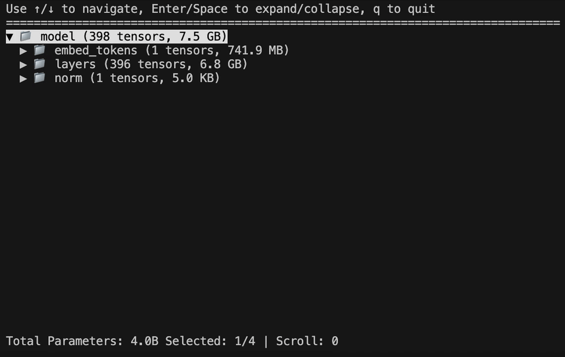

# SafeTensors Explorer

An interactive terminal-based explorer for SafeTensors and GGUF files, designed to help you visualize and navigate the structure of machine learning models.



## Features

- 🔍 **Interactive browsing** of SafeTensors and GGUF file structures
- 📁 **Hierarchical tree view** with expandable/collapsible groups
- 🔢 **Smart numeric sorting** for layer numbers (e.g., layer.0, layer.1, layer.2, ..., layer.10)
- 📊 **Tensor details** including shape, data type, and size
- 🔗 **Multi-file support** - automatically merges multiple files into a unified view
- 📂 **Directory support** - explore entire model directories with automatic SafeTensors index detection
- 🌟 **Glob pattern support** - use wildcards to select multiple files (e.g., `*.safetensors`, `model-*.gguf`)
- 📏 **Human-readable sizes** (B, KB, MB, GB)
- ⌨️ **Keyboard navigation** for smooth exploration
- 🧠 **GGUF support** - view GGML format tensors with quantization types

## Installation

### From crates.io
```bash
cargo install safetensors_explorer
```

### Prerequisites
- Rust (1.70 or later)

### Build from source
```bash
git clone https://github.com/EricLBuehler/safetensors_explorer
cd safetensors_explorer
cargo build --release
```

## Usage

### Basic usage
```bash
# Explore a single SafeTensors file
safetensors_explorer model.safetensors

# Explore a GGUF file
safetensors_explorer model.gguf

# Or if building from source
cargo run -- model.safetensors
cargo run -- model.gguf
```

### Directory exploration
```bash
# Explore all SafeTensors and GGUF files in a directory
safetensors_explorer /path/to/model/directory

# Recursively search subdirectories
safetensors_explorer -r /path/to/models

# The tool automatically detects and uses model.safetensors.index.json if present
safetensors_explorer /path/to/huggingface/model
```

### Multi-file exploration
```bash
# Explore multiple files as a unified model
safetensors_explorer model-00001-of-00003.safetensors model-00002-of-00003.safetensors model-00003-of-00003.safetensors

# Mix SafeTensors and GGUF files
safetensors_explorer model.safetensors model.gguf

# Mix files and directories
safetensors_explorer model.safetensors /path/to/additional/models
```

### Glob pattern support
```bash
# Use wildcards to select multiple files
safetensors_explorer *.safetensors

# Match files with specific patterns
safetensors_explorer model-*.gguf

# Match numbered checkpoint files
safetensors_explorer checkpoint-[0-9]*.safetensors

# Combine multiple patterns
safetensors_explorer *.safetensors *.gguf

# Mix glob patterns with explicit paths
safetensors_explorer model.safetensors checkpoint-*.safetensors
```

### Keyboard Controls

| Key | Action |
|-----|--------|
| `↑` / `↓` | Navigate up/down through the tree |
| `Enter` / `Space` | Expand/collapse groups, view tensor details |
| `q` | Quit the application |
| `Ctrl+C` | Force quit |

## Example Output

```
SafeTensors Explorer - model.safetensors (1/1)
Use ↑/↓ to navigate, Enter/Space to expand/collapse, q to quit
================================================================================

▼ 📁 transformer (123 tensors, 1.2 GB)
  ▼ 📁 h (120 tensors, 1.1 GB)
    ▼ 📁 0 (5 tensors, 45.2 MB)
      📄 attn.c_attn.weight [Float16, (4096, 3072), 25.2 MB]
      📄 attn.c_proj.weight [Float16, (1024, 4096), 8.4 MB]
      📄 ln_1.weight [Float16, (4096,), 8.2 KB]
      📄 mlp.c_fc.weight [Float16, (4096, 11008), 90.1 MB]
      📄 mlp.c_proj.weight [Float16, (11008, 4096), 90.1 MB]
    ▶ 📁 1 (5 tensors, 45.2 MB)
    ▶ 📁 2 (5 tensors, 45.2 MB)
    ...
    ▶ 📁 31 (5 tensors, 45.2 MB)
  📄 ln_f.weight [Float16, (4096,), 8.2 KB]
  📄 wte.weight [Float16, (151936, 4096), 1.2 GB]

Selected: 1/342 | Scroll: 0
```

## How It Works

1. **Path Resolution**: Automatically discovers SafeTensors files from files, directories, or SafeTensors index files
2. **File Loading**: Loads one or more SafeTensors files and extracts tensor metadata
3. **Tree Building**: Organizes tensors into a hierarchical structure based on their names (split by '.')
4. **Smart Sorting**: Uses natural sorting to handle numeric components correctly
5. **Interactive Display**: Renders the tree with expansion/collapse functionality
6. **Tensor Details**: Shows detailed information when selecting individual tensors

## Technical Details

### Supported Formats
- SafeTensors files (`.safetensors`)
- GGUF files (`.gguf`) with GGML tensor types including quantized formats
- SafeTensors index files (`model.safetensors.index.json`)
- Directory scanning with recursive search option
- All tensor data types supported by the SafeTensors and GGML formats

### Performance
- Memory efficient: Only loads tensor metadata, not the actual tensor data
- Fast startup: Optimized for quick exploration of large models
- Responsive UI: Smooth navigation even with thousands of tensors

## Dependencies

- `safetensors` - For reading SafeTensors files
- `gguf` - For reading GGUF files
- `crossterm` - For terminal UI and keyboard input
- `clap` - For command-line argument parsing
- `anyhow` - For error handling
- `serde_json` - For parsing SafeTensors index files
- `glob` - For directory pattern matching

## Contributing

Contributions are welcome! Please feel free to submit issues or pull requests.
